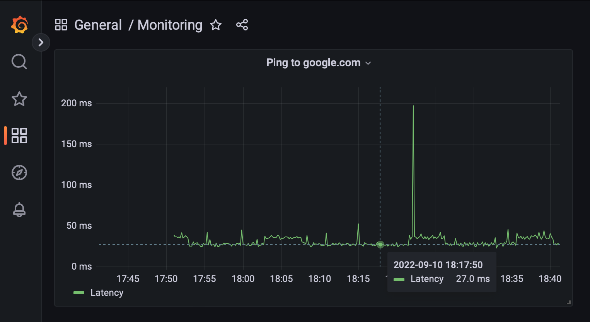

# PingBot

[](https://hub.docker.com/r/krystex/pingbot)

**PingBot** is a dependency-less node app which constantly pings some host and saves the response time to InfluxDB or a CSV-file.

Written with Node v18.

### Running PingBot with InfluxDB (Docker)

<p align="center">
  
</p>

Note: Compatible only with InfluxDB v1.x.

You can run PingBot with InfluxDB and Grafana (for visualization) for example with this `docker-compose.yml` file:
```yml
version: "3"

services:
  pingbot:
    image: krystex/pingbot:latest
    depends_on:
      - influx
    environment:
      INFLUX_HOST: http://influx:8086
      INFLUX_USER: username
      INFLUX_PASS: password
      INFLUX_DB: main

  influx:
    image: influxdb:1.8.10-alpine
    volumes:
      - influx:/var/lib/influxdb
    environment:
      INFLUXDB_ADMIN_USER: username
      INFLUXDB_ADMIN_PASSWORD: password
      INFLUXDB_DB: main

  grafana:
    image: grafana/grafana:9.1.4
    ports:
      - "3000:3000"
    volumes:
      - grafana:/var/lib/grafana

volumes:
  influx:
  grafana:
```

### Running PingBot with CSV-file (Docker)
You simply need create a `ping.csv` file, and run the container with the file as a volume:
```bash
touch ping.csv
docker run --name pingbot -e MODE=csv -v $PWD/ping.csv:/app/ping.csv krystex/pingbot:latest
```


### Configuration
Configuration through environment variables:
| Environment variable | Default | Purpose
| -------------------- | ------- | -------
| `INTERVAL` | `10000` | Millisecond interval in which ping gets executed
| `PING_COMMAND` | `ping -c1 google.com` | Exact ping command
| `MODE` | `influx` | Mode of saving, can be either `csv` or `influx`
| `INFLUX_HOST` | `http://localhost:8086` | InfluxDB hostname to connect to
| `INFLUX_DB` | `main` | InfluxDB database name
| `INFLUX_USER` | - | InfluxDB username for authentication
| `INFLUX_PASS` | - | InfluxDB password for authentication


### Developing locally
```bash
docker network create --driver bridge pingbot-dev
docker run -d --rm --name pingbot-influx-dev \
    --network pingbot-dev\
    -p 8086:8086\
    -e INFLUXDB_ADMIN_USER=username\
    -e INFLUXDB_ADMIN_PASSWORD=password\
    -e INFLUXDB_DB=main\
    influxdb:1.8.10-alpine
docker run --rm --name pingbot-dev -it -v $PWD:/app/ \
    --network pingbot-dev\
    -e INFLUX_HOST=http://pingbot-influx-dev:8086\
    -e INFLUX_USER=username\
    -e INFLUX_PASS=password\
    -e INFLUX_DB=main\
    node:18-alpine sh -c "cd /app;sh"
node index.js  # Execute in container
```
